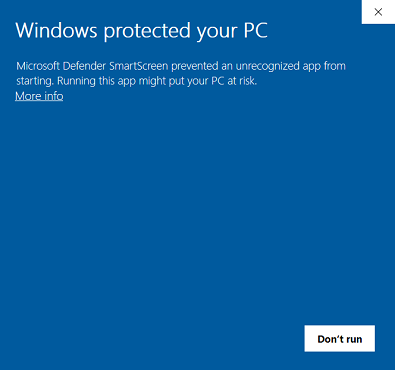
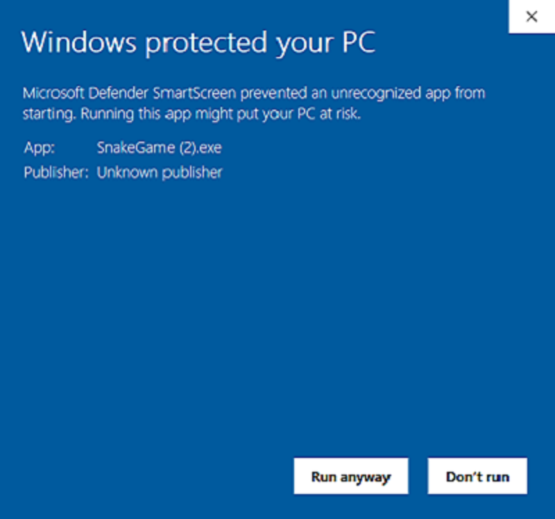

# Charged Mobs Files
Place where my friends can download the creations I make!

#### Things to Know
The READMD.md files in the other folders for the games / creations I've made tell you how to play / use the application. The `.exe` files are executable files which can be run.

The Update-Logs.txt files are to log the updates I make to what stuff I've made like a game.

## How to Download an Executable File

1. Click on the folder which contains the file you want to download:

We will be using the **Snake Game** folder for this demonstration. Ignore the **Z_README** folder, that stores the images for the `Z_README.md` file that you are watching right now.
1. Click on the file that ends in `.exe`:

1. Click the `Download` Button:

## How to Keep / Run the Executable File

**Internet Explorer**:

* Click the `Save` button or the `Run` button
* Click the `Actions` button
* Click the `More Options` dropdown button
* Press `Run Anyway` (This is a one time step for each download)

**Microsoft Edge**:

* Click the three dots next to the button `Delete`
* Select `Keep`. You will then be redirected to the Microsoft Edge `Downloads` Page
* A pop-up will occur. Click on `Show More` and select `Keep Anyway`

**Google Chrome**:

* Click the arrow next to the button `Discard`
  * If there isn't a `Discard` button just click the arrow
* Select `Keep`

**Firefox**:

* Click `Save File`

## How to Always be able to Run the File

**Windows**:

Once you have followed these steps according to your browser, go to where ever you downloaded the .exe file and click on it, once you do that, on Windows, a prompt will tell you that it blocked the .exe file (**This even happens in Administrator mode**).  

  To get around this click where is says `More Info`, you will then get an option called `Run Anyway`. You are now able to run the file to your heart's desire!!

**MacOS**:   
Yeah, I'm not paying $999 for a piece of alluminum

**Ubuntu**:  
*Coming Soon*
