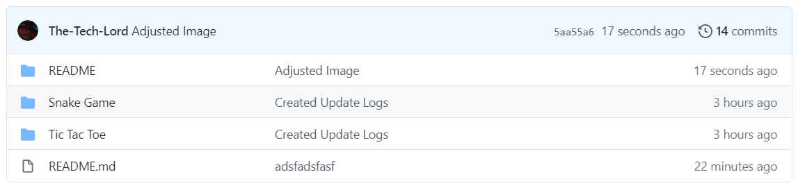
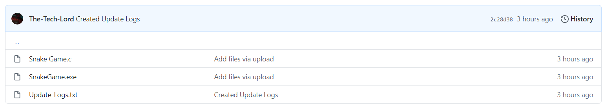
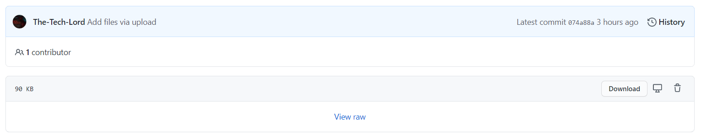

# Charged Mobs Files
Place where my friends can download the creations I make!

## How to Download an Executable File

1. Click on the folder which contains the file you want to download:

We will be using the **Snake Game** folder for this demonstration. Ignore the **README** folder, that stores the images for the `README.md` file that you are watching right now.
1. Click on the file that ends in `.exe`:

1. Click the Download Button:

Once you have downloaded the file, follow the steps below

## How to Keep and Run the File

**Microsoft Edge**:

* Click the three dots next to the button `Delete`
* Select `Keep`. You will then be redirected to the Microsoft Edge `Downloads` Page
* A pop-up will occur. Click on `Show More` and select `Keep Anyway`

**Google Chrome**:  
You will notice a bar at the bottom of your screen that shows the downloaded file

* Click the arrow next to the button `Discard`
* Select `Keep`

**Firefox**:  
You will get a pop-up stating whether or not you'd like to save the file

* Click `Save File`
