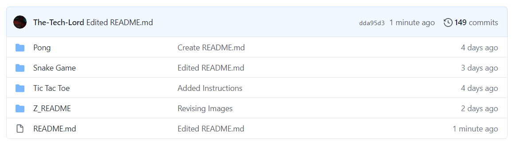
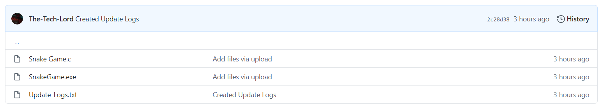
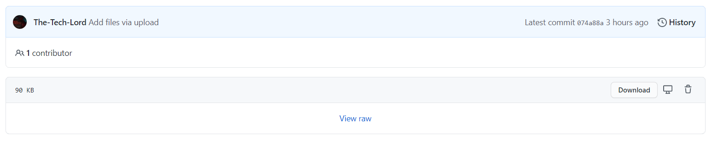

# Charged Mobs Files
Place where my friends can download the creations I make!

### Things to Know
`README.md`: Will tell you about the application I've made and how to use it  
`Update-Logs.txt`: These files are used to keep track of updates that I make  
`SomeFileName.exe`: The executable file that you want to run  
`Z_README` Folder: That folder is used to hold stuff like images for the `README.md` files. Each folder will have a separate &emsp;&emsp;&emsp;&emsp;&emsp;&emsp;&emsp;&nbsp;&nbsp;&nbsp; copy that will store files for their particular `README.md` file

## How to Download an Executable File

1. Click on the folder which contains the file you want to download:  

We will be using the **Snake Game** folder for this demonstration. Ignore the **Z_README** folder, that stores the images for the `Z_README.md` file that you are watching right now.
1. Click on the file that ends in `.exe`:  

1. Click the `Download` Button:  

## How to Keep / Run the Executable File

Most of you should know this but if you don't know how to do this, I've written out how to do it. When you download the file, you should see a bar at the bottom of your screen that shows the downloaded file; With FireFox, it will instead show a popup showing the file you want to download.

**Internet Explorer**:

* Click the `Save` button or the `Run` button
* Click the `Actions` button
* Click the `More Options` dropdown button
* Press `Run Anyway` (This is a one time step for each download)

**Microsoft Edge**:

* Click the three dots next to the button `Delete`
* Select `Keep`. You will then be redirected to the Microsoft Edge `Downloads` Page
* A pop-up will occur. Click on `Show More` and select `Keep Anyway`

**Google Chrome**:

* Click the arrow next to the button `Discard`
  * If there isn't a `Discard` button just click the arrow
* Select `Keep`

**Firefox**:

* Click `Save File`

## How to Always be able to Run the File

**Windows**:

Once you have followed these steps according to your browser, go to where ever you downloaded the .exe file and click on it, once you do that, on Windows, a prompt will tell you that it blocked the .exe file (**This even happens in Administrator mode**). To get around this click where is says `More Info`, you will then get an option called `Run Anyway`. You are now able to run the file to your heart's desire!!  

 

**MacOS**:   
Yeah, I'm not paying $999 for a piece of alluminum

**Ubuntu**:  
*Coming Soon*
